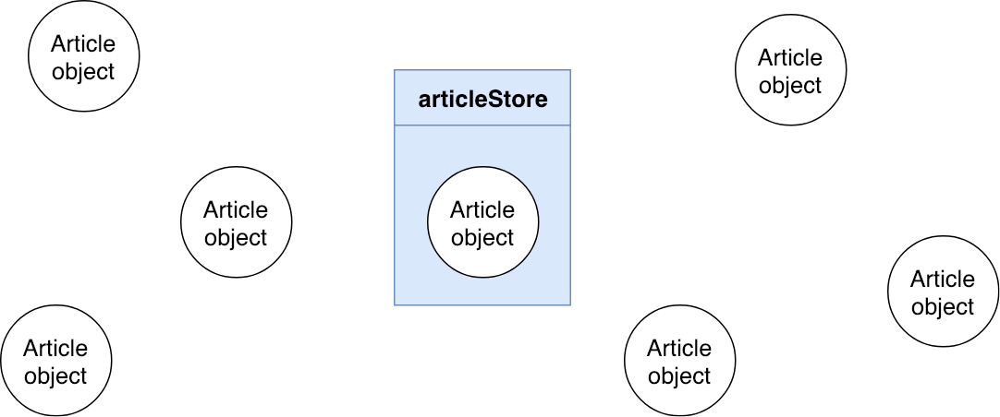
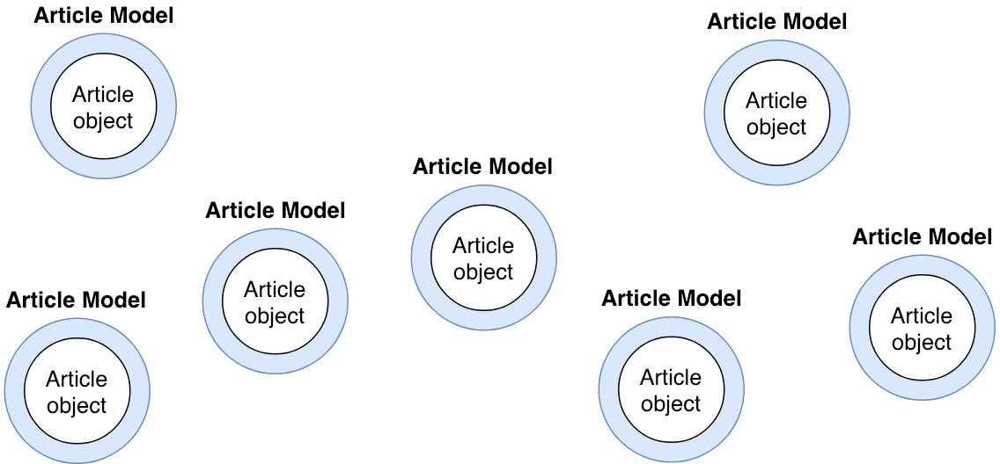
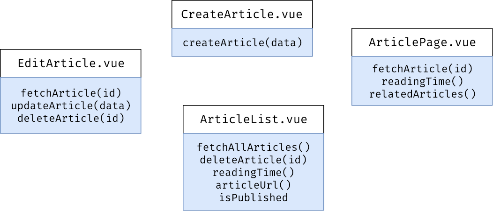

# Introducing Javel
When passing information from Laravel (or another framework) to your JavaScript, It’s easy to forget that you do not have to work with plain JavaScript objects. 

Take the following Vue.js component as an example.

```js 
export default {
    data () {
        return {
            article: null,
        }
    },
    methods: {
        async fetchArticle (id) {
            this.article = await axios.get(`/api/article/${id}`)
        },
        async updateArticle (data) {
            // Assuming the server returns the updated article.
            this.article = await axios.patch(`/api/article/${this.article.id}`, data)
        }
    },
    computed: {
        articleUrl () { /* ... */ },
        isPublished () { /* ... */ },
        readingTime () { /* ... */ },
    },
}
```

This is a typical component that end up with all the burden of creating custom accessors, mutators and asynchronous calls to our server.

If we assume this component handles the edition of an article, we can imagine that some of this logic will also be needed for other components, e.g. creating articles, finding related articles, presenting all the comments of an article, etc.

## Easy on the stores
To stay DRY in these situation, developers tend to jump on the occasion to use **store frameworks** like Vuex, Redux or (better yet) by creating their own humble version.

Whilst stores are a good way to regroup all of the logic related to a piece of information, they’re often not what you need.

In our previous example, we could create a new `articleStore` with a state that includes a `currentArticle`. Then the methods could be defined in the store as actions and the computed properties as getters. However that logic is now limited to one article at a time which just feels like we’re forcing the wrong tool into our problem.



Don’t get me wrong, stores are hugely useful but only when they are used in the way they were intended to. That is, when a particular piece of information needs to be shared across multiple components, e.g. a `userStore` that keeps track of the authenticated user. But in that case, all we want is to wrap some extra logic to a native type. That’s just object oriented programming.

## Models in your JavaScript
Let’s stop managing those powerless JavaScript objects and wrap them in something more useful.

Taking our article example, here is what extracting all of that logic to a class could look like.

```js
export default class Article
{
    construct (attributes) {
        this.setAttributes(attributes)
    }

    setAttributes (attributes) {
        Object.assign(this, attributes)
    }

    static async find (id) {
        let { data } = await axios.get(`/api/article/${id}`)
        let article = new Article(data)
    }

    async update (attributes) {
        let { data } = await axios.patch(`/api/article/${this.id}`, attributes)
        this.setAttributes(data)
    }

    get articleUrl () { /* ... */ },
    get isPublished () { /* ... */ },
    get readingTime () { /* ... */ },
}
```

We can now interact with our articles in a much more intuitive Laravel-ish way.

```js
let article = await Article.find(1)
article = await article.update(newData)

article.url
article.isPublished
article.readingTime
```

Using models in this case is much more convenient than using stores since we can now assume all of our `articles` are instances of our `Article` class.



## Don’t start from scratch
I’ve been creating a lot of JavaScript models in a way that matches Eloquent’s style (Laravel’s active record) and I found myself repeating the same logic across multiple projects. All my models would extend a `Model` class that defines the main asynchronous API calls like `find`, `create`, `save`, etc.

For that reason I decided to extract that logic into a package that I called "Javel" (mix of JavaScript and Laravel, plus it means bleach in french and that’s gonna clean your frontend).

Javel, provides us with a powerful base model that you can configure to match the requirements of your project.

<GithubButton url="https://github.com/lorisleiva/javel" title="Javel on GitHub"></GithubButton>

Let rewrite our `Article` class using Javel.

```js
import Model from ‘javel’

export default class Article extends Model
{
    get articleUrl () { /* ... */ },
    get isPublished () { /* ... */ },
    get readingTime () { /* ... */ },
}
```

And that’s it! You now have access to a range of useful methods that will make API calls on your behalf and handle responses appropriately.

```js
await Article.all()                                         // => [ Article* ]
await Article.paginate({ data: { page: 2 } })               // => { data: [ Article* ], current_page: 2, ... }
await Article.find(1)                                       // => Article { id: 1, ... }

let article = await Article.create({ name: 'My article' })  // => Article { id: 2, name: 'My article' }
await article.update({ name: 'My updated article' })        // => Article { id: 2, name: 'My updated article' }
await article.delete()                                      // => Deleted from the server

article = new Article({ name: 'My draft blog post' })
article.name = 'My new blog post'
await article.save()                                        // => Article { id: 3, name: 'My new blog post', ... }
```

## Wait a minute...
### how do you know I’m using `axios` ?

By default Javel will use axios if it is available from the `window` (which is the case for Laravel applications by default).

If you wish to change that, simply override the `makeRequest` method.

```js
export default class Article extends Model
{
    makeRequest (request) {
        return // Return a promise from your HTTP service.
    }
}
```

<small>Check out the documentation for more information on the [content of the request object](https://github.com/lorisleiva/javel/blob/0b3b64d245561392497c850aa69e0c6b2fc0a767/docs/MakesRequests.md#the-request-object) or if you need some [examples to get started](https://github.com/lorisleiva/javel/blob/0b3b64d245561392497c850aa69e0c6b2fc0a767/docs/MakesRequests.md#configure-your-http-service).</small>

### How do you know that my URLs are prefixed with `/api` ?

That’s the default base URL that Javel uses. You can change that by overriding the `baseUrl` method. Note that you might want to override this method on a `Model` superclass.

```js
import Model as BaseModel from 'javel'

export default class Model extends BaseModel
{
    baseUrl (request) {
        return 'api/v2'
    }
}
```

### How do you know which URL to use altogether?

Javel will use the `snake_case` of your class name followed by any parameters that might be given to the requests. For example, a class called `Article` will use the following URLs by default.

```
all         => '/api/article' (GET)
paginate    => '/api/article' (GET)
find        => '/api/article/:id' (GET)
create      => '/api/article' (POST)
persist     => '/api/article' (POST)
update      => '/api/article/:id' (PATCH)
delete      => '/api/article/:id' (DELETE)
```

However, if your JavaScript is minified for production, your class name will not stay the same and your requests will fail. For that reason, it’s better to be explicit about your URLs. [Read more about this gotcha](https://github.com/lorisleiva/javel/blob/0b3b64d245561392497c850aa69e0c6b2fc0a767/docs/MakesRequests.md#default-buildurl-and-minification-issue) in the documentation.

You can be more explicit about your URLs by overriding the `buildUrl` method.

```js
export default class Article extends Model
{
    buildUrl (request) {
        // Extract what you need from the request object.
        const { action, params, data } = request

        // Build a URL by returning a string.
        if (action === 'all' && data.category) {
            return `category/${data.category.id}/articles`
        }

        // Build a URL by returning an array which will be properly joined.
        return ['article', ...params]
    }
}
```

### What are you doing with the responses of my API calls?

By default, if the request was a static call (e.g. `find`, `create` or `all`) the response will be wrapped in a new model or in an array of new models. If the request was not static then we are likely dealing with an existing model and therefore its attributes will be updated with the response’s data.

You’ll likely want to customise this logic by overriding the `afterRequest` method.

```js
export default class Article extends Model
{
    afterRequest (response, request) {
        return request.isStatic ? this.make(response.data) : this.fill(response.data)
    }
}
```

### How can I create my own API calls?

Easy, you just make a call to the `request()` method which will go through the whole process for you. For example, let’s create a new endpoint that publishes an existing article.

```js
export default class Article extends Model
{
    async publish () {
        const data = { published_at: new Date().toISOString() }
        return this.request({ method: 'PATCH', url: `article/${this.id}`, data })
    }
}
```

Alternatively, you can delegate to existing endpoints.

```js
export default class Article extends Model
{
    async publish () {
        return this.update({ published_at: new Date().toISOString() })
    }
}
```

## Mixins in your JavaScript
As the previous questions have shown, each project have their own requirements and configuration is key when defining generic models. 

That’s why Javel is written as a set of mixins. Each mixin contribute to the models by providing its own piece of logic. At the time of writing this article, these are the mixins that are included in Javel’s model:

- [HasAttributes](https://github.com/lorisleiva/javel/blob/0b3b64d245561392497c850aa69e0c6b2fc0a767/docs/HasAttributes.md) Defines the basis of getting and setting attributes on a Model and provide some useful methods like `primaryKey`, `exists`, `is`, `clone`, etc.
- [HasRelationships](https://github.com/lorisleiva/javel/blob/0b3b64d245561392497c850aa69e0c6b2fc0a767/docs/HasRelationships.md) Enables models to configure their relationships with each other so that their attributes are automatically wrapped in the right model.
- [KeepsParentRelationship](https://github.com/lorisleiva/javel/blob/0b3b64d245561392497c850aa69e0c6b2fc0a767/docs/KeepsParentRelationship.md) Ensures each child relationship keeps track of its parent and how to access itself from it. This enables models to climb up the relationship tree and even remove themselves from their parent when deleted.
- [MakesRequests](https://github.com/lorisleiva/javel/blob/0b3b64d245561392497c850aa69e0c6b2fc0a767/docs/MakesRequests.md) Introduces async actions (`find`, `create`, `update`, etc.) to conveniently request the server and provides all the hooks necessary to customize how to handle your request/response proctol for each model.

<small>Javel also provides additional (more opinionated) mixins that are not included in the base model but that you can plug when needed.</small>

Under the hood, Javel uses the [mixwith](https://github.com/justinfagnani/mixwith.js) library to assemble mixins together. Javel also exposes this library back to you so you can easily create your own mixins.

```js
import { Model as BaseModel, Mixin, mix } from 'javel'

// Create a mixin
const MyMixin = Mixin(superclass => class extends superclass {
    // ...
})

// Use a mixin
class Model extends mix(BaseModel).with(MyMixin) {
    // ...
}
```

## Conclusions
Since we are encouraged to break down our applications into small components, we can easily end up giving them to much responsibility. Individually they look nice and small and they are easy to reason about. But as a whole, we can find our model logic duplicated and scattered everywhere.



Javel helps you bring a bit of Eloquent into your JavaScript to free our components of that burden and create a single point of failure.


I hope you find this package useful and don’t hesitate to share your mixins with the community. 🎁

<GithubButton url="https://github.com/lorisleiva/javel" title="Javel on GitHub"></GithubButton>
